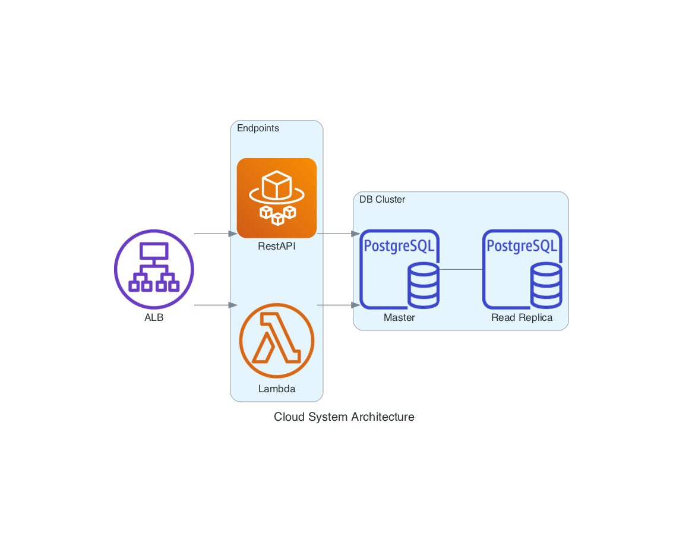

[](https://codecov.io/gh/from81/FastAPI-Based-RestAPI)

# About


# Data sources
`ogr2ogr -f "PostgreSQL" PG:"dbname=$POSTGRES_DB user=$POSTGRES_USER password=$POSTGRES_PASSWORD" data/nsw_polygon.json -nln nsw_polygon -nlt POLYGON`

- OSM Australia
- boundary: https://www.igismap.com/australia-shapefile-download/
- neighborhood: https://data.gov.au/data/dataset/nsw-local-government-areas

# Database
connect to db (requires installation of [jq](https://stedolan.github.io/jq/)):
`./psql.sh credentials_prod.json`
## Run
```
docker build -t postgis_image -f ./Dockerfile_postgis .
docker container run -it --publish 5432:5432 --rm --env-file ./.env --name postgis postgis_image bash
docker container run -it --publish 5432:5432 --env-file ./.env --name postgis postgis_image bash
```

# Rest API

## Run
```
uvicorn --host=0.0.0.0 --port=80 app.main:app --reload
uvicorn --host=0.0.0.0 --port=80 app.main:app
```

```
docker build -t geoapi_image ./

docker container run --publish 80:80 --detach --env-file ./.env --name <container_name> <image_name>
docker container run --publish 80:80 --detach --env-file ./.env --name geoapi geoapi_image
docker container run --publish 80:80 --env-file ./.env --name geoapi geoapi_image
```

## Update desired task count
```
aws ecs update-service --cluster geoapi-cluster --service geoapi --desired-count 0
```

## Test URL and params
- Sydney
    - http://geoapi-alb-1921781293.ap-southeast-2.elb.amazonaws.com/neighborhood?lat=-33.8657512&lon=151.2030053
- Newtown
    - http://geoapi-alb-1921781293.ap-southeast-2.elb.amazonaws.com/neighborhood?lat=-33.89773430654297&lon=151.1786619347163
- Chippendale
    - http://geoapi-alb-1921781293.ap-southeast-2.elb.amazonaws.com/neighborhood?lat=-33.88479146163441&lon=151.200800661913

## pytest for codecov

pytest -s --verbose --color=yes --showlocals -r p --cov=app --cov-report=term