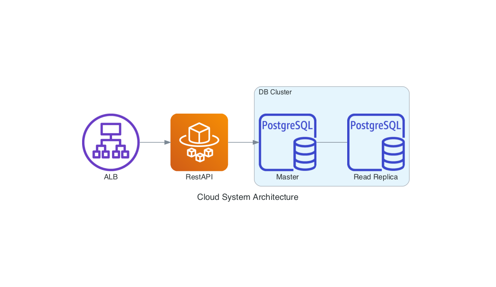

# Design



# Database

make `psql.sh` executable
`chmod +x psql.sh`

connect to db (requires installation of [jq](https://stedolan.github.io/jq/)):
`./psql.sh credentials_prod.json`

## Data

- OSM Australia
- boundary: https://www.igismap.com/australia-shapefile-download/
- neighborhood: https://data.gov.au/data/dataset/nsw-local-government-areas

# Rest API

## Run
```
uvicorn --host=0.0.0.0 --port=80 app.main:app --reload
uvicorn --host=0.0.0.0 --port=80 app.main:app
```

```
docker build -t geoapiv1 ./

docker container run --publish 80:80 --detach --env-file ./.env --name <container_name> <image_name>
docker container run --publish 80:80 --detach --env-file ./.env --name geoapi geoapiv1
docker container run --publish 80:80 --env-file ./.env --name geoapi geoapiv1
```

## Update desired task count
```
aws ecs update-service --cluster geoapi-cluster --service geoapi --desired-count 0
```

## Test URL and params
- Sydney: http://geoapi-alb-1921781293.ap-southeast-2.elb.amazonaws.com/neighborhood?lat=-33.8657512&lon=151.2030053
- Newtown: http://geoapi-alb-1921781293.ap-southeast-2.elb.amazonaws.com/neighborhood?lat=-33.89773430654297&lon=151.1786619347163
- Chippendale: http://geoapi-alb-1921781293.ap-southeast-2.elb.amazonaws.com/neighborhood?lat=-33.88479146163441&lon=151.200800661913

## pytest for codecov

pytest --verbose --color=yes --assert=plain